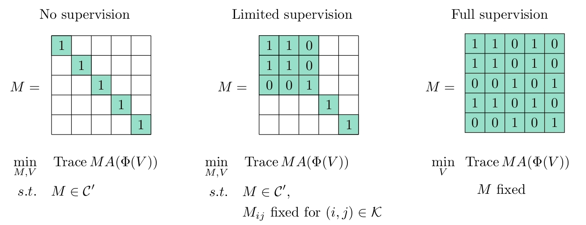

XSDC
====================================

This repository contains companion code for the following [paper](https://link.springer.com/article/10.1007/s11222-021-10067-x):

C. Jones, V. Roulet and Z. Harchaoui. Discriminative clustering with representation learning with any ratio of labeled to unlabeled data. *Statistics and Computing* **32**, 17 (2022).

If you use this code please cite the paper using the bibtex reference below.

```
@article{JRH2022,
  title={Discriminative Clustering with Representation Learning for any Ratio of Labeled to Unlabeled Data},
  author={Jones, Corinne and Roulet, Vincent and Harchaoui, Zaid},
  journal  = "Statistics and Computing",
  volume   =  32,
  number   =  1,
  pages    = "17",
  month    =  jan,
  year     =  2022
}
```

Introduction
-----------------
In the paper *Discriminative Clustering with Representation Learning for any Ratio of Labeled to Unlabeled Data* we propose a unified framework that allows one to jointly learn a feature representation from unlabeled data (with or without labeled data) and predict labels for unlabeled data. The proposed approach is domain-agnostic and can be used with any amount of labeled and unlabeled data, gracefully adjusting to the amount of supervision.

The proposed objective function for the cases where we have no labels, some labels, or all of the labels is summarized in the figure below.


Figure: Example equivalence matrix M=YY<sup>T</sup> and problem for varying levels of supervision.

Here M=YY<sup>T</sup> is the equivalence matrix, where Y is the one-hot label matrix. The matrix A is a function of the output of a network, Φ, where the network is parameterized by V. The set C' contains the constraints on the labels, while the set K contains the indices (i,j) for which the entries M<sub>i,j</sub> are known. 

The XSDC algorithm, which optimizes the objective function, alternates between obtaining an approximate solution M<sup>(t)</sup> to the assignment problem on a mini-batch and taking a gradient step to update V. The assignment problem is solved using a matrix balancing algorithm we develop in the paper.


Installation
-----------------
This code is compatible with Python 3.7 and was written with PyTorch version 1.2.0.

The primary dependencies are:

* [Faiss](https://github.com/facebookresearch/faiss) version 1.5.2
* [Jupyter](https://jupyter.org/) version 4.4.0
* [Matplotlib](https://matplotlib.org/) version 3.1.1
* [Numpy](https://numpy.org/) version 1.17.3
* [Pandas](https://pandas.pydata.org/) version 0.25.3
* [PyTorch](https://pytorch.org/) version **1.2.0** and torchvision 0.4.0
* [Scikit-image](https://scikit-image.org/) version 0.15.0
* [Scikit-learn](https://scikit-learn.org/stable/) version 0.21.3
* [Scipy](https://www.scipy.org/) version 1.3.1


The remainder of the dependencies are standard and e.g., come pre-installed with Anaconda. The code can run on a CPU or GPU. The following terminal commands create a new Anaconda environment called *xsdc* and install the GPU versions of the above packages, assuming you have Cuda 10.0:

```
conda create -y --name=xsdc python=3.7
conda activate xsdc
conda install jupyter matplotlib nb_conda numpy pandas scipy scikit-image scikit-learn
conda install pytorch=1.2 torchvision cudatoolkit=10.0 -c pytorch
conda install faiss-gpu cudatoolkit=10.0 -c pytorch
```

If you wish to run the code on a GPU with a different version of Cuda, see the [PyTorch](https://pytorch.org/) and [Faiss](https://github.com/facebookresearch/faiss/blob/master/INSTALL.md) documentations. If you only have a CPU you should change the last two lines above to
```
conda install pytorch=1.2 torchvision cpuonly -c pytorch
conda install faiss-cpu -c pytorch
```

The code is currently set to run on a GPU. To run it on a CPU change the line
`device = torch.device('cuda:0')`
 in the file src/default_params.py to `device = torch.device('cpu')`.

This version of the code is not compatible with older versions of PyTorch. The code has only been tested on Linux operating systems.


Datasets
-----------------
The experiments were performed on the Gisette, MAGIC, MNIST, and CIFAR-10 datasets. You can download the versions of the first two datasets at the URLs below. The others will be automatically downloaded when running the code.

- Gisette: https://www.csie.ntu.edu.tw/~cjlin/libsvmtools/datasets/binary.html
- MAGIC: https://archive.ics.uci.edu/ml/datasets/magic+gamma+telescope

The code assumes that you did not change the names of the files. The filepaths should be:
- For Gisette: `xsdc/data/gisette_scale/gisette_scale`, `xsdc/data/gisette_scale/gisette_scale.t`
- For MAGIC: `xsdc/data/magic/magic04.data`


Example
-----------------
An example Jupyter notebook that describes how to set up and train a LeNet-5 CKN on MNIST may be found at example/mnist_lenet-5_example.ipynb.

The shell scripts to reproduce the main experiments are in the subfolders under "experiments". You may need to modify the path to the data folder via the argument `data_path`.

Baseline experiments
--------------------
In the folder experiments/baseline, you will find the baseline experiments that compare the method XSDC against semi-supervised k-means with seeding for different choices of kernels. This part of the code is independent of the rest. Make sure that you uploaded the datasets Gisette and Magic in the folder datasets as `baseline/datasets/gisette_scale/gisette_scale`, `baseline/datasets/gisette_scale/gisette_scale.t`, `baseline/datasets/magic/magic04.data`. The figures of the paper can be reproduced by running the script `exp_baseline.py`. The code is based on an implementation of semi-supervised k-means with seeding of Basu et al. (2002) which can be found in the file `semi_sup_kmeans.py` and tested in `test_semi_sup_kmeans.py`.

Basu, S., Banerjee, A., & Mooney, R. (2002). Semi-supervised clustering by seeding. In Proceedings of International Conference on Machine Learning.

Contact
-----------------
You can report issues and ask questions in the repository's issues page. If you choose to send an email instead, please direct it to Corinne Jones at cjones6@uw.edu and include [xsdc] in the subject line.


Authors
-----------------
[Corinne Jones](https://www.stat.washington.edu/people/cjones6/)  
[Vincent Roulet](http://faculty.washington.edu/vroulet/)  
[Zaid Harchaoui](http://faculty.washington.edu/zaid/)  


License
-----------------
This code has a GPLv3 license.


Acknowledgements
--------------------------
This work was supported by NSF CCF-1740551, NSF DMS-1810975, the program “Learning in Machines and Brains” of CIFAR, and faculty research awards.
